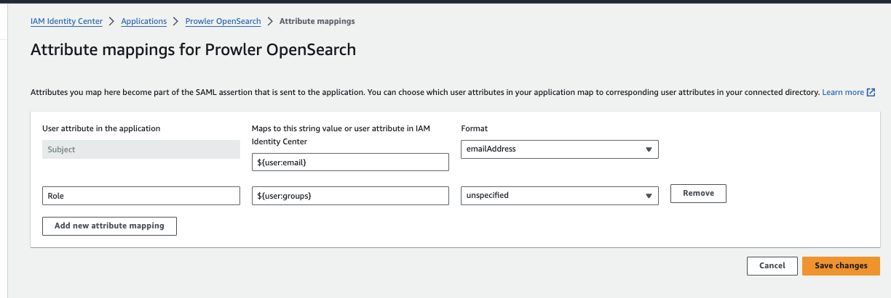
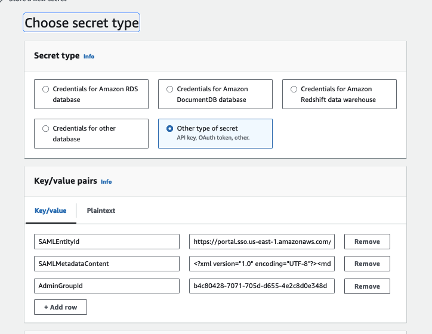

# prowler-searchcluster

Manage Prowler & Security Hub findings in OpenSearch

## Deploying Prowler

1. Create a config file named `config.FOO` with your specific settings.
  ```
  export DEPLOY_BUCKET=fooli-deploy
  export DEPLOY_PREFIX=prowler
  export CHECKS_FILE=fooli-checks.json
  export CONFIG_FILE=fooli-config.yaml
  export PROWLER_MANIFEST=Fooli-Prowler-Manifest.yaml
  export IMAGE_VERSION=20230805-1201

  # Used by a local run
  export ROLENAME=fooli-audit
  export PAYER_ID=123456789012
  export OUTPUT_BUCKET=fooli-prowler
  ```
2. Create Manifest. `cft-generate-manifest -m Fooli-Prowler-Manifest.yaml -t cloudformation/Prowler-Template.yaml`
3. Edit Manifest.
    1. If you're not using opensearch, you can just set the `pDomainEndpoint` to the value of NONE
3. Make the ECR Repo: `make env=FOO repo`
4. Push the container:  `make env=FOO push` (you need docker running)
    1. Update the Config file to set the correct `IMAGE_VERSION`
5. Deploy: `make env=FOO prowler-deploy`


## Deploying OpenSearch

1. Generate a [`cft-deploy`](https://pypi.org/project/cftdeploy/) Manifest file:
  ```bash
  cft-generate-manifest -m Manifests/my-Opensearch-Manifest.yaml -t pht-prowler-searchcluster/cloudformation/OpenSearch-Template.yaml
  ```
2. Edit the values in that template to match your environment.
  1. It's recommended to adjust the timeout to 45min or more.
2. Deploy the stack with `cft-deploy -m Manifests/my-Opensearch-Manifest.yaml`
2. Get the Admin Password from Secrets Manager
2. Enable [IAM Mapping](https://docs.aws.amazon.com/opensearch-service/latest/developerguide/fgac.html#fgac-more-masters). This is needed to leveage IAM roles to access the OpenSearch.
  1. `./scripts/enable_iam_roles.sh <OpenSearch-StackName> <Prowler-StackName>`


### Deploying OpenSearch / AWS Identity Center Integration

This process is based on this [Blog Post](https://aws.amazon.com/blogs/big-data/role-based-access-control-in-amazon-opensearch-service-via-saml-integration-with-aws-iam-identity-center/)

All Settings from AWS Identity Center are placed into a Secrets Manager secret for use by CloudFormation when deploying or updating the OpenSearch Cluster.

1. To begin, go to AWS Identity Center, and click "Add application"
2. Choose "I have an application I want to set up", then "SAML 2.0", then "Next"
3. For Display Name, use choose what to call this, such as "Prowler OpenSearch". Add a description if so desired.
4. Download the `IAM Identity Center SAML metadata file` to your computer
5. Copy the `IAM Identity Center SAML issuer URL`
6. Enter `https://DOMAIN_ENDPOINT_URL/_dashboards/_opendistro/_security/saml/acs/idpinitiated` for "Application ACS URL"
  1. You can get the value of DOMAIN_ENDPOINT_URL from the output of the OpenSearch stack. If you choose a custom endpoint, you can should use that here (such as `prowler.fooli.media`)
7. Enter `https://DOMAIN_ENDPOINT_URL` for Application SAML audience
8. Click "Submit"
9. Edit the Attribute Mappings. They should look like:

10. Create an admin Group for OpenSearch.
  1. Enter a group name, such as "prowler-opensearch-admin"
  2. Add users to the group
  3. Click Create
  4. Go back to the group you just created, and under "General Information", copy the Group ID. It should look like `046988c4-70e1-70bf-8071-ff5a9e1b82b4`
11. You should have three values saved:
  1. The Admin Group ID
  2. The IAM Identity Center SAML issuer URL
  3. The contents of the SAML metadata file.

In the AWS account with the OpenSearch cluster, create a AWS Secrets Manager Secret. Map these values:
* `SAMLEntityId` -> `IAM Identity Center SAML issuer URL`
* `SAMLMetadataContent` -> The _contents_ of the metadata file you downloaded
* `AdminGroupId` -> The ID of the group created in AWS Identity Center

The values should look like:


Finally, update the OpenSearch Manifest `pSAMLConfigSecret` with the name of the Secrets Manager secret, and re-deploy OpenSearch.


